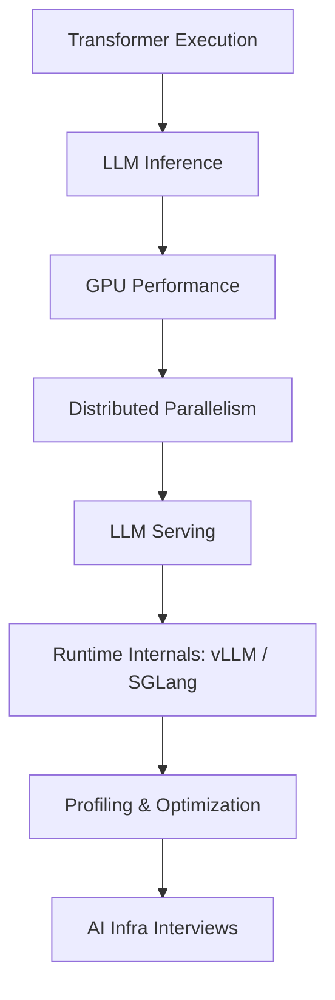

<div align="center">

# AI Infra 101

### From Transformer internals to production LLM systems

**A compact, interview-oriented handbook for LLM inference, GPU performance, distributed parallelism, serving runtimes, profiling, and system design.**

[](LICENSE)


**[中文](README.zh-CN.md) · [100+ Questions](interview/100-questions.md) · [1-Minute Answers](interview/core-answers.md) · [Calculators](tools/README.md) · [Reading List](resources/reading-list.md)**

</div>

---

## Why AI Infra 101?

AI Infra material is excellent but fragmented. You learn Transformer math in one place, CUDA in another, NCCL somewhere else, then discover that real LLM serving adds KV-cache management, continuous batching, scheduling, prefix reuse, distributed execution, and performance debugging.

**AI Infra 101 connects those pieces into one systems mental model.**

It is built around three questions:

> **What must I know?**  
> **Can I derive / implement it without memorizing APIs?**  
> **Can I use it to diagnose a real LLM system?**

This is intentionally **not** a giant course or link dump. Each chapter is designed to be read in one sitting and includes:

- the minimum concepts that matter;
- formulas and tensor shapes;
- worked examples;
- common interview traps;
- implementation/derivation expectations;
- high-signal references for deeper study.

---

## The stack



| Layer | Learn to reason about | Handbook |
|---|---|---|
| **01 Transformer Execution** | RMSNorm, RoPE, MHA/MQA/GQA, SwiGLU, MoE, shapes, GEMMs | [Read →](docs/01-transformer-execution.md) |
| **02 LLM Inference** | prefill vs decode, KV cache, batching, quantization, speculation | [Read →](docs/02-llm-inference.md) |
| **03 GPU Performance** | SIMT, memory hierarchy, Roofline, fusion, FlashAttention | [Read →](docs/03-gpu-performance.md) |
| **04 Distributed Parallelism** | collectives, TP/PP/DP/EP, topology, overlap | [Read →](docs/04-distributed-parallelism.md) |
| **05 LLM Serving** | TTFT/TPOT, continuous batching, PagedAttention, chunked prefill, P/D | [Read →](docs/05-llm-serving.md) |
| **06 Runtime Internals** | scheduler → KV manager → model runner → attention backend | [Read →](docs/06-runtime-internals.md) |
| **07 Profiling** | nsys/ncu, bottleneck classification, experiments, regression checks | [Read →](docs/07-profiling.md) |
| **08 Interview Prep** | hand-write, derivations, project deep-dives, system design | [Read →](docs/08-interview-prep.md) |

---

## What does “know it” mean?

Recognition is not enough.

| Level | Standard |
|---|---|
| **Explain** | Give a precise 1–3 minute explanation without notes. |
| **Derive** | Reconstruct shapes, memory, FLOPs, bandwidth or communication on paper. |
| **Implement** | Write concise PyTorch/CUDA-like pseudocode or working code. |
| **Diagnose** | Given a latency/throughput problem, propose evidence, profiler steps, and trade-offs. |

For an AI Infra internship, aim for:

```text
whole stack       → Explain + Derive
Transformer/tensor → Implement
inference/GPU      → Diagnose
```

---

## The shortest useful path

If you do not have time for full courses, use the repository in this order:

```text
01 Transformer Execution
       ↓
02 Inference + KV calculations
       ↓
03 GPU / Roofline
       ↓
04 TP/PP/EP derivations
       ↓
05 Serving mechanisms
       ↓
06 Trace one request through vLLM/SGLang
       ↓
07 Profile one real workload
       ↓
08 Mock interview
```

Then drill with:

- **[100+ AI Infra questions](interview/100-questions.md)** — broad self-test;
- **[30 core 1-minute answers](interview/core-answers.md)** — answer structures, not scripts;
- **[Hand-write checklist](interview/handwrite-checklist.md)** — what to implement from memory;
- **[Formula sheet](cheatsheets/formulas.md)** — KV/FLOPs/Roofline quick reference;
- **[Collectives sheet](cheatsheets/collectives.md)** — AllReduce/AllGather/ReduceScatter/AllToAll.

---

## Tiny calculators

Back-of-the-envelope calculations are a core AI Infra skill, so the repo includes small dependency-free tools.

### KV-cache capacity

```bash
python tools/kv_cache_calculator.py \
  --layers 32 --kv-heads 8 --head-dim 128 \
  --seq-len 16384 --bytes-per-element 2 \
  --concurrency 16 --kv-budget-gib 32
```

### Roofline estimate

```bash
python tools/roofline_estimator.py \
  --flops 2e12 --bytes 1e11 \
  --peak-tflops 100 --bandwidth-gbs 2000
```

### TP communication estimate

```bash
python tools/tp_comm_estimator.py \
  --message-mib 16 --bandwidth-gbs 400 \
  --latency-us 5 --collectives-per-layer 2 --layers 80
```

See **[tools/README.md](tools/README.md)** for assumptions and caveats.

---

## Questions you should eventually answer without notes

### Model / inference

- Why scale attention by `1/sqrt(d_head)`?
- Why does GQA reduce KV memory?
- Why does KV caching not make attention O(1)?
- Why is small-batch decode often bandwidth-bound?
- Why can larger batch improve throughput but worsen latency?

### GPU

- What does arithmetic intensity tell you?
- Why can 100% occupancy still be slow?
- GEMV vs GEMM: why do they stress hardware differently?
- Why does fusion help memory-bound operations?
- Why is FlashAttention an IO optimization?

### Distributed

- Derive a 2-way tensor-parallel MLP.
- Why does TP prefer high-bandwidth intra-node links?
- What creates a PP bubble?
- Why does MoE expert parallelism naturally use AllToAll?
- When can communication actually overlap with compute?

### Serving / runtime

- Continuous batching vs static batching?
- What exactly does PagedAttention solve?
- Why does chunked prefill protect TPOT?
- Cache locality vs load balancing?
- What new bottleneck appears after P/D disaggregation?
- Trace one request through scheduler → KV manager → model runner.

### Performance

- High TTFT but normal TPOT: where do you look?
- Low GPU utilization: how do you narrow the cause?
- Nsight Systems vs Nsight Compute?
- Throughput improved but P99 regressed: was the optimization successful?

---

## High-signal external references

This handbook is original explanatory material plus carefully selected references. It does **not** copy other repositories' prose.

A few sources worth bookmarking:

- **GPU MODE / awesomeMLSys** — ML-systems paper onboarding: https://github.com/gpu-mode/awesomeMLSys
- **JAX Scaling Book** — inference math and scaling reasoning: https://jax-ml.github.io/scaling-book/
- **Inside vLLM** — modern runtime walkthrough: https://vllm.ai/blog/2025-09-05-anatomy-of-vllm
- **vLLM docs/source** — https://docs.vllm.ai/ · https://github.com/vllm-project/vllm
- **SGLang docs/source** — https://docs.sglang.ai/ · https://github.com/sgl-project/sglang
- **GPU MODE lectures** — CUDA/profiling/NCCL/serving: https://github.com/gpu-mode/lectures
- **BBuf CUDA optimization notes** — practical GPU/kernel notes: https://github.com/BBuf/how-to-optim-algorithm-in-cuda
- **Megatron-LM** — distributed Transformer parallelism: https://github.com/NVIDIA/Megatron-LM
- **TorchCode** — auto-graded ML/LLM hand-write exercises: https://github.com/duoan/TorchCode
- **Awesome LLM System Design** — system-design prompts: https://github.com/neurarch-ai/awesome-llm-system-design

More: **[annotated reading list](resources/reading-list.md)**.

---

## What is intentionally out of scope?

To keep the path short, this repository does not try to be a complete curriculum for:

- basic C++ / Python syntax;
- introductory CUDA syntax;
- generic backend engineering;
- Kubernetes/MLOps administration;
- RAG/vector-database application engineering;
- pretraining/post-training algorithms;
- every new inference paper.

Those are useful subjects, but a roadmap becomes less useful when it includes everything.

---

## Contributing

Contributions are welcome—especially:

- concise explanations that replace jargon with mechanisms;
- worked numerical examples;
- real AI Infra interview questions;
- vLLM/SGLang/Megatron architecture updates;
- profiling case studies;
- corrected formulas or misleading simplifications;
- small calculators/visualizations.

**Please do not dump hundreds of links.** Every new resource should answer:

> What does this teach better than the alternatives already listed?

See [CONTRIBUTING.md](CONTRIBUTING.md).

---

## License

MIT for original material in this repository. External resources retain their own licenses and copyrights; this repository links to them and provides original summaries rather than redistributing their text.

---

<div align="center">

**If AI Infra 101 saves you time, consider starring the repo — it helps more systems learners find it. ⭐**

</div>
