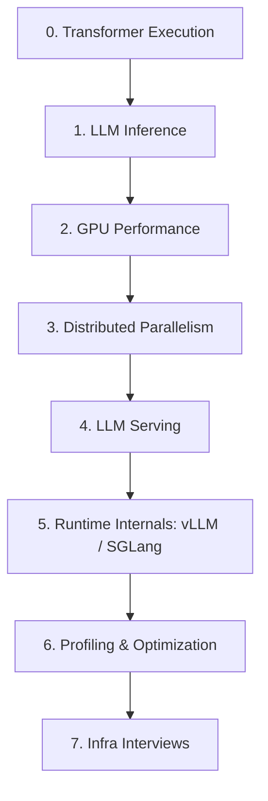

# AI Infra 101

> **The shortest path from Transformer internals to LLM inference / serving interviews.**
>
> A compact, interview-oriented knowledge map for students and engineers who already know Python/C++/CUDA basics and want to build a systems mental model of modern AI infrastructure.

**中文版本： [README.zh-CN.md](README.zh-CN.md)**

## Why this repo?

AI Infra learning material is excellent but fragmented. Transformer internals, GPU performance, distributed parallelism, LLM serving, vLLM/SGLang, profiling, and interview coding are usually taught in different courses or repositories.

**AI Infra 101 is not another giant course.** It is a compressed map:

> **What must I know? → What is the shortest good resource? → What should I be able to derive / explain / implement in an interview?**

This repo intentionally focuses on **LLM systems / inference / serving / runtime / GPU performance** rather than generic MLOps, Kubernetes, RAG application development, or basic programming syntax.

---

## The stack

| Layer | You should be able to... | Start here |
|---|---|---|
| 0. Transformer execution | trace tensors through a Llama-style block; derive shapes/FLOPs; hand-write attention/RMSNorm/RoPE/GQA/SwiGLU | [docs/01-transformer-execution.md](docs/01-transformer-execution.md) |
| 1. LLM inference | explain prefill vs decode, derive KV-cache memory, reason about batching, prefix caching, quantization and speculative decoding | [docs/02-llm-inference.md](docs/02-llm-inference.md) |
| 2. GPU performance | reason with SIMT, memory hierarchy, occupancy and Roofline; explain why FlashAttention works | [docs/03-gpu-performance.md](docs/03-gpu-performance.md) |
| 3. Distributed | derive TP/PP/DP/EP communication and choose a parallel strategy from model/hardware constraints | [docs/04-distributed-parallelism.md](docs/04-distributed-parallelism.md) |
| 4. Serving | understand TTFT/TPOT/goodput, continuous batching, PagedAttention, chunked prefill, scheduling and P/D disaggregation | [docs/05-llm-serving.md](docs/05-llm-serving.md) |
| 5. Runtime internals | follow one request through scheduler → KV manager → model runner → attention backend | [docs/06-runtime-internals.md](docs/06-runtime-internals.md) |
| 6. Profiling | use timeline → kernel analysis → hypothesis → optimization instead of guessing | [docs/07-profiling.md](docs/07-profiling.md) |
| 7. Interviews | answer rapid-fire fundamentals, implement common tensor ops, and structure LLM serving system-design answers | [docs/08-interview-prep.md](docs/08-interview-prep.md) |

---

## If you only have 10 hours

Do these in order:

1. **Transformer execution:** read the component checklist and implement MHA → GQA → KV cache once.
2. **Inference math:** work through the KV-cache and bandwidth formulas in [`cheatsheets/formulas.md`](cheatsheets/formulas.md).
3. **GPU mental model:** learn Roofline + memory hierarchy; understand why decode and FlashAttention behave differently.
4. **Parallelism:** derive the Megatron column-parallel + row-parallel MLP by hand.
5. **Serving:** understand continuous batching, PagedAttention, chunked prefill, prefix caching and P/D disaggregation.
6. **Runtime:** read *Inside vLLM: Anatomy of a High-Throughput LLM Inference System* and trace one request in the codebase.
7. **Interview:** use [`interview/100-questions.md`](interview/100-questions.md) and [`interview/handwrite-checklist.md`](interview/handwrite-checklist.md).

---

## Definition of “know it”

For every topic, use four levels:

| Level | Standard |
|---|---|
| **Explain** | Give a precise 2–3 minute explanation without notes. |
| **Derive** | Derive shapes, memory, FLOPs or communication volume on paper. |
| **Implement** | Write concise PyTorch/CUDA-like pseudocode or working code for the core mechanism. |
| **Diagnose** | Given a latency/throughput problem, identify plausible bottlenecks and a profiling plan. |

For an AI Infra internship, **Explain + Derive** should be strong across the whole stack; **Implement** should be strong for Transformer/tensor fundamentals; **Diagnose** should be credible for inference and GPU performance.

---

## Core references (high signal)

These are the resources this repo recommends most often:

- **GPU MODE / awesomeMLSys** — compact ML-systems onboarding list: https://github.com/gpu-mode/awesomeMLSys
- **JAX Scaling Book — Inference** — excellent inference cost/memory math: https://github.com/jax-ml/scaling-book/blob/main/inference.md
- **Inside vLLM** — one of the best modern runtime walkthroughs: https://vllm.ai/blog/2025-09-05-anatomy-of-vllm
- **vLLM** — production inference runtime: https://github.com/vllm-project/vllm
- **SGLang** — high-performance serving runtime and RadixAttention: https://github.com/sgl-project/sglang
- **GPU MODE lectures** — profiling, CUDA performance, FlashAttention, NCCL, serving: https://github.com/gpu-mode/lectures
- **GPU MODE resource stream** — curated GPU-performance references: https://github.com/gpu-mode/resource-stream
- **BBuf CUDA optimization notes** — practical CUDA/kernel/LLM systems notes: https://github.com/BBuf/how-to-optim-algorithm-in-cuda
- **Megatron-LM** — distributed Transformer parallelism: https://github.com/NVIDIA/Megatron-LM
- **Stas Bekman ML Engineering** — clear model-parallelism notes: https://github.com/stas00/ml-engineering
- **TorchCode** — auto-graded ML/LLM hand-writing practice: https://github.com/duoan/TorchCode
- **TorchLeet** — PyTorch + LLM interview exercises: https://github.com/Exorust/TorchLeet
- **Modern Transformer from scratch** — compact modern decoder implementation: https://github.com/ruisp666/transformer-from-scratch
- **Awesome LLM System Design** — interview-style system-design questions: https://github.com/neurarch-ai/awesome-llm-system-design
- **AI-Infra (Chinese)** — broad Chinese AI-infrastructure landscape: https://github.com/pacoxu/AI-Infra

Full annotated list: **[resources/reading-list.md](resources/reading-list.md)**.

---

## What is intentionally out of scope?

This is **not** a complete curriculum for:

- basic C++ / Python syntax;
- introductory CUDA programming;
- generic backend engineering;
- Kubernetes/MLOps administration;
- RAG/vector-database application engineering;
- model pretraining/post-training algorithms;
- every new inference paper.

Those are valuable, but including everything makes a beginner roadmap less useful.

---

## Interview-ready checkpoints

You are in good shape when you can answer these without memorized scripts:

- Why is small-batch decode often memory-bandwidth bound?
- Derive KV-cache bytes for a GQA model.
- Why does GQA reduce serving memory but not model width?
- Why can batching increase throughput but hurt latency?
- How does continuous batching differ from static batching?
- What problem does PagedAttention solve, and what does it *not* solve?
- Why does chunked prefill help mixed prefill/decode workloads?
- Derive communication in a 2-way tensor-parallel MLP.
- Why is EP dominated by all-to-all in many MoE workloads?
- When would you use TP vs PP vs DP/EP?
- Explain FlashAttention as an IO optimization rather than an approximation.
- How would you debug low GPU utilization in an LLM server?
- What would you look at first in Nsight Systems vs Nsight Compute?
- Trace one request through vLLM or SGLang.

For a larger bank: [interview/100-questions.md](interview/100-questions.md).

---

## Contributing

PRs are welcome, especially for:

- better short-form explanations;
- interview questions with real system implications;
- high-quality first-party engineering blogs;
- vLLM/SGLang/Megatron architecture changes;
- corrected formulas or misleading simplifications.

Please avoid dumping hundreds of links. Every resource should answer: **what does this teach better than the alternatives?**

See [CONTRIBUTING.md](CONTRIBUTING.md).

## License

MIT for original material in this repository. External resources retain their own licenses and copyrights; this repository links to them and provides original summaries rather than redistributing their text.
